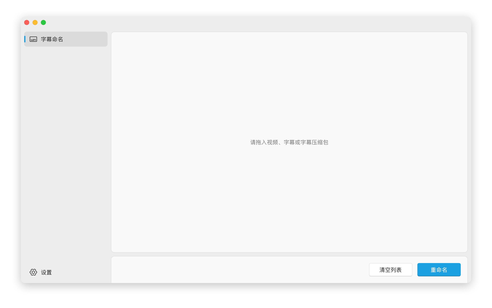

<div align="center">

<br/>
<br/>


[](https://github.com/nuthx/subtitle-renamer/releases/latest)

</div>

## 介绍

世界上又多了一个跨平台的轻量级视频字幕批量重命名工具，**用于重命名动画与电影字幕**。

<p align="center">

</p>

## 特色

- 基于 [Tauri](https://v2.tauri.app/zh-cn/) 构建，原生性能，轻量体积
- 优雅的 Fluent UI 界面，支持 [Mica](https://learn.microsoft.com/zh-cn/windows/apps/design/style/mica) 与 [Varbint](https://developer.apple.com/cn/design/human-interface-guidelines/materials#Platform-considerations) 材质
- 极速识别简体与繁体字幕，并为不同语言添加自定义后缀
- 允许拖入字幕压缩包，并在重命名完成后自动删除
- 支持扩展名转换、自动复制或删除字幕、转换 UTF-8 编码等
- 以及你 [提出](https://github.com/nuthx/subtitle-renamer/issues) 的更多功能

## 使用

1. 拖入要重命名的视频与字幕文件或压缩包，支持分批次拖入，并自动去重
2. 确认视频与字幕文件顺序与数量相同后，点击 `重命名`
3. 完成！

## 常见问题

#### 1. macOS 运行提示 “未打开”、“已损坏”、或 “移到废纸篓” 等弹窗

由于缺少签名，导致无法直接打开下载的应用程序，需手动移除应用的安全隔离属性

将 `Subtitle Renamer` 拖入到 `Application` 文件夹后，打开终端，输入以下命令：

```bash
sudo xattr -dr com.apple.quarantine '/Applications/Subtitle Renamer.app'
```

若程序不在 `/Applications` 目录下，请将 `/Applications/Subtitle Renamer.app` 替换为实际路径

尝试启动软件，若仍然无法打开，可继续尝试以下方法：

进入 “系统设置” -> “隐私与安全性”，滑动至最底部，在 “已阻止 Subtitle Renamer 以保护 Mac” 中点击 “仍要打开”

## 免责声明

本项目代码仅供学习交流，不得用于商业用途，若侵权请联系
