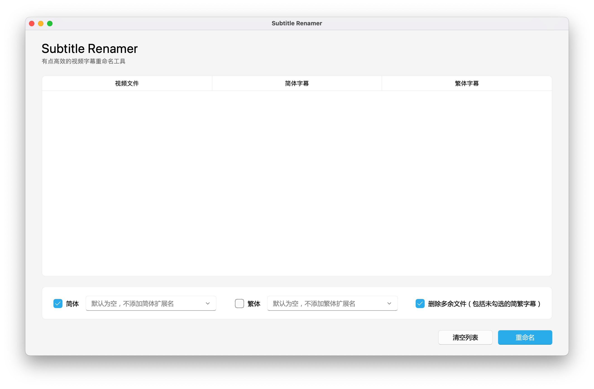

    
     
    

        
        
        
        
    

## 介绍

世界上又多了一个基于 Python 的视频字幕批量重命名工具，**用于重命名动画与电影字幕**。

    

## 特色

- 多平台支持，开箱即用
- 优雅的 GUI 界面（使用 [PyQt-Fluent-Widgets](https://github.com/zhiyiYo/PyQt-Fluent-Widgets) 主题组件）
- 自动识别简繁字幕文件
- 自定义简繁后缀 ( `.sc` or `.tc` )
- （可选）重命名完成后移动字幕至视频目录
- （可选）删除未命名的字幕
- （可选）转换字幕编码至 UTF-8 或 UTF-8-SIG

## 使用

1. 拖入待更名的视频与字幕文件，需保持字幕与视频数量相等
2. 使用左下角的`简体`或`繁体`来选择字幕语言
3. 在设置中配置重命名时的可选项
4. 点击`重命名`
5. 完成！

**注意：** 请在`重命名`开始前确保结果准确无误，`重命名`开始后，**操作不可撤销**。

## 反馈

如需要更多功能支持，请在 Issues 中提出，酌情添加。

如遇到程序错误，请在 Issues 中详细描述，并告知所用操作系统（Windows 11 or macOS 13.4）。

## 免责

本项目代码仅供学习交流，不得用于商业用途，若侵权请联系。
